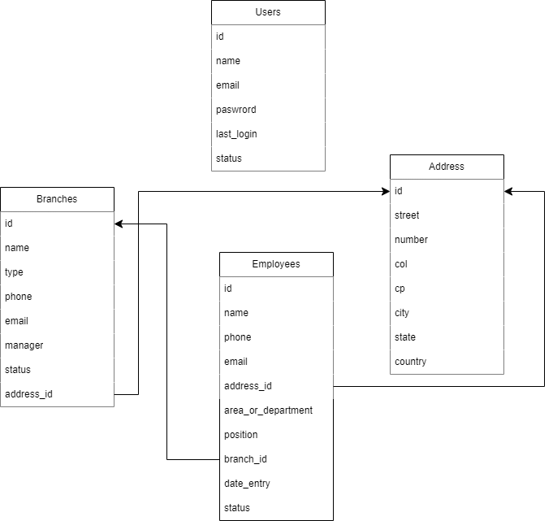

# 🦆patito\_system

## Descripción del proyecto

Este proyecto es una prueba técnica que busca solucionar la siguiente problemática:

La empresa **Patito S.A. de C.V.**, con más de 10 años de operación, ha logrado posicionar varias sucursales a lo largo de todo el país. Debido a ello, se ha enfrentado con varias problemáticas para la gestión de la información de su personal, ya que no cuentan con una base de datos centralizada. Es por ello que se ha visto en la necesidad de contratar a una empresa externa que le apoye a generar un sistema que le permita llevar el control de dicha información.

## Tecnologías utilizadas

* Laravel
* Inertia.js
* Vue 3
* Tailwind CSS
* Laravel Breeze

## modelado

Se definieron las siguientes entidades para el proyecto:

Es posible seguir normalizando para evitar la redundancia de datos, sin embargo, por tema de tiempo y sencilles del proyecto, se realizó de esta manera.

## Notas

* El entorno de ejecución utilizado es el mismo que incluye el archivo de .env.example, en este archivo viene incluido el nombre de la base de datos, usuario y el puerto.
* Las credenciales para inciar sesión son las siguientes, correo: carlos@email.com y contraseña: password123
 
## Comandos utilizados durante el proyecto

### Estrutura base
* composer create-project laravel/laravel patito_system
* composer require inertiajs/inertia-laravel
* composer require inertia:middleware
* npm install vue@^3 @vitejs/plugin-vue
* npm install @inertiajs/inertia @inertiajs/inertia-vue3
* composer require laravel/breeze --dev
* php artisan breeze:install vue

### Generación de archivos o ejecución de los mismos
* php artisan make:seeder [nombre del seeder]
* php artisan db:seed --class=NombreDelSeeder
* php artisan db:seed
* composer dump-autoload
* php artisan make:factory [nombre del fatcory].php
* php artisan make:Request [nombre del request]
* php artisan migrate:refresh --seed
